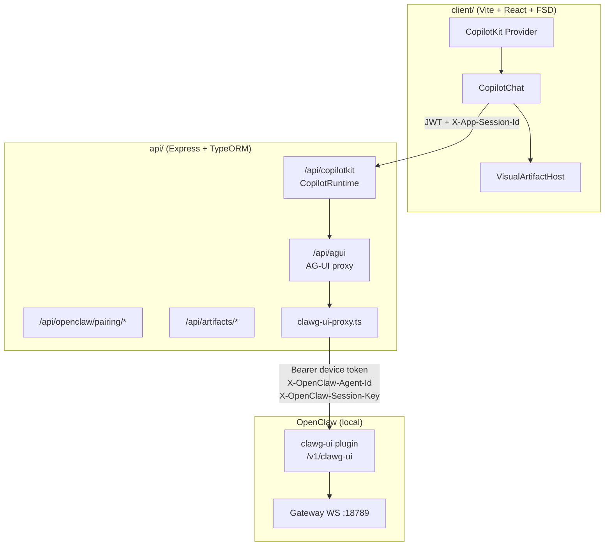

# SPEC-001 — Refatoração do Chat para CopilotKit + AG-UI + clawg-ui

| Campo | Valor |
|-------|-------|
| **Status** | `accepted` |
| **Versão** | `0.1.0` |
| **Data** | 2026-06-08 |
| **Escopo** | `openclaw-client` (client + api) |
| **Referência técnica** | Implementação em `api/src/` + `client/src/features/copilot/` (sem checkout externo) |
| **Pré-requisito** | Plugin `clawg-ui` instalado no OpenClaw local |
| **Padrão** | Harness Engineering (spec como artefato primário; código como saída verificável) |

---

## 1. Resumo executivo

Substituir o chat customizado (MUI + SSE manual + parsing JSONL) por **CopilotKit** como superfície de UI, usando o protocolo **AG-UI** para comunicação com o runtime OpenClaw via plugin **`clawg-ui`**.

O backend Express permanece como **único ponto de confiança**: injeta credenciais, headers de sessão e faz proxy SSE para `clawg-ui`. O browser **nunca** fala diretamente com o gateway nem com `clawg-ui`.

**Fórmula:** `CopilotKit (UI) → CopilotRuntime (API) → HttpAgent/AG-UI (API) → clawg-ui (OpenClaw) → agentes/tools/memória`.

---

## 2. Contexto

### 2.1 Estado atual (AS-IS)

| Camada | Implementação | Limitações |
|--------|---------------|------------|
| **UI** | `widgets/chat` — `MessageList`, `MessageBubble`, `ChatInput`, `useSendMessage` | Renderização manual; sem artifacts visuais genéricos; thinking/tool steps acoplados ao JSONL |
| **Transporte** | `POST /api/message/chat` → SSE custom via `ocService.runChat` | Protocolo proprietário; duplica lógica de streaming |
| **Sincronização** | Poll `GET /api/message/poll/:conversationId` + leitura JSONL | Race conditions; dedup complexa; `externalId` instável |
| **OpenClaw** | Gateway WS direto + CLI fallback + `jsonlParser` | Acoplamento forte ao formato JSONL do daemon |
| **Auth app** | JWT (`admin@admin.com`) | OK — manter |
| **Sessão** | `conversations.sessionKey` mapeia para sessão OpenClaw | Sem `threadId` AG-UI estável explícito |

### 2.2 Referência (TO-BE validada)

O padrão alvo (CopilotRuntime → HttpAgent → clawg-ui) está implementado neste monorepo:

```
Browser ──► /api/copilotkit (CopilotRuntime)
              └── HttpAgent ──► /api/agui (proxy SSE interno)
                    └── POST clawg-ui /v1/clawg-ui (AG-UI SSE)
                          └── OpenClaw gateway (runtime)
```

Arquivos-chave da referência:

| Arquivo | Responsabilidade |
|---------|------------------|
| `src/app/api/copilotkit/route.ts` | Monta `CopilotRuntime` + `HttpAgent` |
| `src/app/api/agui/route.ts` | Valida sessão, persiste mensagens, despacha proxy |
| `src/lib/openclaw/clawg-ui-proxy.ts` | Proxy SSE bidirecional + side-effects |
| `src/lib/agui/event-parser.ts` | Parser SSE AG-UI |
| `src/components/OpenClawCopilotChat.tsx` | `<CopilotKit>` + `<CopilotChat>` |
| `AGENTS.md` | Constituição / invariantes |
| `docs/API.md`, `docs/SECURITY.md`, `docs/DECISIONS.md` | Contratos e ADRs |

### 2.3 Diferença estrutural a adaptar

A referência usa **Next.js App Router**. Este projeto usa **Express + Vite + Feature-Sliced Design**. A spec **não** migra para Next.js; portar os módulos de `src/lib/` e `src/components/` para a estrutura FSD existente.

---

## 3. Decisões arquiteturais (ADR-lite)

### D-001 — CopilotKit como UI, clawg-ui como bridge AG-UI

- **Status:** aceita (herdada da referência)
- **Decisão:** CopilotKit roda somente no client; Express expõe `/api/copilotkit` e `/api/agui`; OpenClaw permanece fonte de verdade do runtime.
- **Consequência:** eliminar `useSendMessage` + SSE manual; manter JWT para auth do app.

### D-002 — Manter Express + Vite (não adotar Next.js)

- **Status:** aceita
- **Contexto:** o app já tem deploy em `~/.openclaw_client`, PWA, FSD, TypeORM.
- **Decisão:** portar rotas e libs da referência para `api/src/routes/copilotkit/` e `api/src/services/agui/`.
- **Consequência:** usar `@copilotkit/runtime` com handler Express (não `copilotRuntimeNextJSAppRouterEndpoint`).

### D-003 — Reutilizar `conversations` como sessão AG-UI

- **Status:** aceita
- **Decisão:** estender entidade `Conversation` com `threadId` (ULID estável) e `appSessionToken` (HMAC). `sessionKey` existente vira `X-OpenClaw-Session-Key`.
- **Consequência:** migração TypeORM; conversas antigas recebem `threadId` no primeiro acesso pós-migração.

### D-004 — Pairing clawg-ui obrigatório antes do chat

- **Status:** aceita
- **Decisão:** fluxo de pairing idêntico à referência (`pairing_pending` → device token criptografado → `paired` após `RUN_FINISHED`).
- **Consequência:** nova tabela `gateway_profiles` ou colunas em config singleton.

### D-005 — Visual artifacts via `VisualArtifactHost` genérico

- **Status:** aceita
- **Decisão:** sem renderers por tipo semântico (`dashboard`, `chart`, `table`). Despacho por `artifact.protocol`.
- **Consequência:** substituir `MessageBubble` tool-steps por bandeja de artifacts + iframe sandbox.

### D-006 — Deprecar `POST /message/chat` após cutover

- **Status:** aceita
- **Decisão:** manter rota legada por 1 release com header `Deprecation: true`; remover após testes E2E verdes.
- **Consequência:** `useSendMessage`, `runChat` SSE e partes de `jsonlParser` para histórico somente.

---

## 4. Arquitetura alvo



### 4.1 Responsabilidades por camada

| Camada | Faz | Não faz |
|--------|-----|---------|
| **CopilotKit (client)** | Render chat, streaming UI, input, abort | Escolher modelo; falar com gateway; guardar tokens OpenClaw |
| **CopilotRuntime (api)** | Traduzir protocolo CopilotKit ↔ AG-UI | Injetar credenciais OpenClaw (delega ao `/api/agui`) |
| **AG-UI proxy (api)** | HMAC sessão, pairing check, persistência, proxy SSE | Executar tools no host |
| **clawg-ui (OpenClaw)** | Bridge AG-UI ↔ gateway | Auth do app (JWT) |
| **OpenClaw gateway** | Agentes, tools, memória, `run_code` | UI de chat |

---

## 5. Invariantes (constituição — `AGENTS.md`)

Estes invariantes **devem** ser adicionados ao `AGENTS.md` raiz do projeto. Violação = PR bloqueado.

| # | Invariante | Enforcement |
|---|------------|-------------|
| I-01 | `clawg_ui_device_token` nunca no bundle frontend, logs ou respostas HTTP | ESLint `no-restricted-imports` em `client/` para `@/lib/security/crypto`; grep CI |
| I-02 | Browser nunca envia `X-OpenClaw-Session-Key` | Teste estrutural: client não contém string `X-OpenClaw-Session-Key` |
| I-03 | `OPENCLAW_GATEWAY_TOKEN` / operator token nunca como Bearer do clawg-ui | Unit test em `buildClawgUiHeaders` |
| I-04 | Todo chat passa por `/api/copilotkit` → `/api/agui` → clawg-ui | Teste integração: mock upstream; sem fetch direto a `:18789` no client |
| I-05 | `conversations.thread_id` estável por conversa; nunca novo thread por mensagem | Teste DB + proxy |
| I-06 | `agent.openclawAgentId` imutável após primeira mensagem da conversa | Middleware Express |
| I-07 | Backend injeta `X-OpenClaw-Agent-Id` e `X-OpenClaw-Session-Key` | Unit test `buildClawgUiHeaders` |
| I-08 | Sem renderer semântico por tipo; só `VisualArtifactHost` por `protocol` | ESLint: proibir imports `*Chart*`, `*Dashboard*` em `widgets/chat` |
| I-09 | HTML arbitrário só em `<iframe sandbox>` via `/api/artifacts/:id/frame` | Teste segurança CSP |
| I-10 | Eventos AG-UI persistidos em `agui_events`; reproduzíveis por fixtures SSE | Teste com `tests/fixtures/*.sse` |
| I-11 | `sessionId` no proxy = `conversationId` via `X-App-Session-Id` HMAC | Unit test `verifyAppSessionToken` |
| I-12 | Tokens OpenClaw em repouso: AES-256-GCM + HKDF de `APP_AUTH_SECRET` | Teste round-trip crypto |
| I-13 | Gateway WS indisponível → modo degradado (chat via clawg-ui HTTP continua) | Smoke test |
| I-14 | `run_code` é tool do gateway, não client tool CopilotKit | Proxy filtra `tools` com `name=run_code` |

---

## 6. Contratos de API (novos endpoints)

Base path: `/api` (Express existente). Auth: `Authorization: Bearer <jwt>` em todas as rotas abaixo, exceto artifacts frame com token de sessão.

### 6.1 CopilotKit Runtime

```
POST /api/copilotkit
GET  /api/copilotkit
OPTIONS /api/copilotkit
```

- Monta `CopilotRuntime` com factory:
  ```ts
  agents: ({ request }) => ({
    openclaw: new HttpAgent({ url: resolveAguiUrl(request) }),
  })
  ```
- **Sem** `ExperimentalEmptyAdapter` (ver D-010 da referência — causa "No default agent").
- Headers `x-*` do browser são encaminhados automaticamente pelo CopilotKit.

### 6.2 AG-UI Proxy (interno)

```
POST /api/agui
```

- Header obrigatório: `X-App-Session-Id: <conversationId>.<hmac>`
- Body: `RunAgentInput` (CopilotKit / AG-UI)
- Resposta: `text/event-stream` AG-UI
- Side-effects: gravar `agui_events`, `messages` (índice), `visual_artifacts`, `runs`

### 6.3 Pairing clawg-ui

```
POST /api/openclaw/pairing/start
POST /api/openclaw/pairing/check
POST /api/openclaw/pairing/approve
```

Portar de `api/src/routes/openclaw/pairing/` (implementado).

### 6.4 Artifacts

```
GET /api/artifacts/:id
GET /api/artifacts/:id/frame
GET /api/artifacts/:id/download
GET /api/conversations/:id/artifacts
```

### 6.5 Runs

```
DELETE /api/runs/:runId
```

### 6.6 Endpoints legados (deprecar)

| Rota | Ação |
|------|------|
| `POST /message/chat` | Deprecar → remover |
| `GET /message/poll/:conversationId` | Manter para histórico pré-migração; desligar após backfill AG-UI |

---

## 7. Modelo de dados (TypeORM / SQLite)

### 7.1 Alterações em tabelas existentes

**`conversations`** — adicionar colunas:

| Coluna | Tipo | Descrição |
|--------|------|-----------|
| `threadId` | `text` NOT NULL (após migração) | ULID estável para `RunAgentInput.threadId` |
| `userScope` | `text` | Valor sanitizado de `X-OpenClaw-Session-Key` |
| `pairingStatus` | `text` | `paired \| pairing_pending \| unauthorized` |
| `status` | `text` | `idle \| running \| error` |
| `modelOverride` | `text` NULL | Opcional |
| `lastMessageAt` | `datetime` NULL | Touch em `RUN_FINISHED` |

**`messages`** — adicionar:

| Coluna | Tipo | Descrição |
|--------|------|-----------|
| `aguiMessageId` | `text` NULL | ID AG-UI |
| `runId` | `text` NULL | Correlação com run |
| `content` | `json` NULL | Payload AG-UI bruto (índice) |
| `textPreview` | `text` NULL | Primeiros 240 chars |
| `status` | `text` | `complete \| streaming \| error` |

### 7.2 Novas tabelas

| Tabela | Propósito |
|--------|-----------|
| `gateway_profiles` | URL clawg-ui, device token criptografado, pairing status |
| `agui_events` | Log append-only de eventos SSE (auditoria + fixtures) |
| `visual_artifacts` | Metadata de artifacts (`protocol`, `storage_ref`, `content_hash`) |
| `runs` | Estado de execução (`started`, `finished`, `aborted`, `error`) |

Schemas detalhados: ver entidades TypeORM em `api/src/entities/`.

### 7.3 Migração de dados

1. Gerar `threadId = ulid()` para conversas com `sessionKey` existente.
2. Mapear `sessionKey` → `userScope` (sanitizar via `assertValidSessionKey`).
3. Mensagens históricas permanecem em `messages`; novas mensagens AG-UI coexistem.
4. Backfill opcional: importar JSONL para `messages` com flag `source=jsonl_legacy`.

---

## 8. Mapeamento de módulos (Feature-Sliced Design)

### 8.1 Client (`client/src/`)

| Camada FSD | Atual | Alvo |
|------------|-------|------|
| `widgets/chat` | `Chat`, `MessageList`, `ChatInput` | `CopilotChatWidget` (wrapper CopilotKit) |
| `features/message/send` | `useSendMessage` | **Remover** após cutover |
| `entities/message` | RTK Query + `MessageBubble` | Manter query de histórico; bubble legado só para mensagens `source=jsonl_legacy` |
| `features/copilot` (novo) | — | `CopilotProvider`, token de sessão, pairing panel |
| `features/artifact` (novo) | — | `VisualArtifactHost`, `ArtifactTray`, iframe frame |
| `shared/api` | `baseApi` | Adicionar rotas pairing/artifacts |

**Arquivos novos (portar da referência):**

```
client/src/
├── features/copilot/
│   ├── ui/OpenClawCopilotChat.tsx      ← de referência
│   ├── ui/PairingPanel.tsx
│   └── model/useAppSessionToken.ts
├── features/artifact/
│   ├── ui/VisualArtifactHost.tsx
│   ├── ui/McpAppContainer.tsx
│   └── ui/ArtifactTray.tsx
└── widgets/chat/
    └── ui/CopilotChatWidget.tsx         ← substitui Chat.tsx
```

### 8.2 API (`api/src/`)

```
api/src/
├── routes/
│   ├── copilotkit/index.ts              ← CopilotRuntime handler
│   ├── agui/index.ts                    ← POST proxy
│   ├── openclaw/pairing.ts
│   ├── artifacts/
│   └── runs/
├── services/
│   ├── agui/
│   │   ├── clawg-ui-proxy.ts            ← portar
│   │   ├── event-parser.ts
│   │   └── run-code-observer.ts
│   ├── artifacts/
│   │   ├── artifact-normalizer.ts
│   │   └── artifact-store.ts
│   └── security/
│       ├── app-session.ts               ← HMAC conversationId
│       ├── crypto.ts
│       └── session-scope.ts
└── entities/
    ├── GatewayProfile.ts
    ├── AguiEvent.ts
    ├── VisualArtifact.ts
    └── Run.ts
```

### 8.3 Dependências novas

**client/package.json:**
```json
"@copilotkit/react-core": "^1.10.0",
"@copilotkit/react-ui": "^1.10.0"
```

**api/package.json:**
```json
"@copilotkit/runtime": "^1.10.0",
"@ag-ui/client": "^0.0.x",
"eventsource-parser": "^3.x",
"ulid": "^2.x"
```

---

## 9. Configuração e integração OpenClaw

### 9.1 Variáveis de ambiente (`api/.env`)

```env
# clawg-ui (plugin já instalado)
OPENCLAW_GATEWAY_URL=http://127.0.0.1:18789
OPENCLAW_CLAWG_UI_PATH=/v1/clawg-ui
OPENCLAW_GATEWAY_TOKEN=<token do gateway — NÃO usar como bearer clawg-ui>

# Sessão app
APP_AUTH_SECRET=<min 32 chars>
SESSION_KEY_SALT=<random>

# Artifacts
VISUAL_ARTIFACT_MAX_HTML_BYTES=5000000
ARTIFACT_FRAME_ORIGIN=

# OpenClaw paths (já existentes)
OPENCLAW_BIN=C:\Users\<user>\.openclaw_client\openclaw-wrapper.cmd
OPENCLAW_HOME=C:\Users\<user>\.openclaw
```

### 9.2 `openclaw.json` — requisitos

- Plugin `clawg-ui` habilitado (já instalado pelo usuário).
- `gateway.controlUi.allowedOrigins` deve incluir `http://localhost:18800` (client).
- Token do gateway sincronizado com ClawX se aplicável (`gateway.auth.token`).

### 9.3 URL clawg-ui

Construir: `${OPENCLAW_GATEWAY_URL}${OPENCLAW_CLAWG_UI_PATH}` → ex.: `http://127.0.0.1:18789/v1/clawg-ui`

---

## 10. Plano de implementação (depth-first)

Cada fase termina com **gate verificável** antes da próxima. Atualizar `docs/HARNESS_REPORT.md` ao fim de cada fase.

### Fase 0 — Harness bootstrap (1–2 dias)

| Entrega | Verificação |
|---------|-------------|
| Criar `AGENTS.md` raiz com invariantes I-01..I-14 | Review checklist |
| Criar `docs/HARNESS_REPORT.md`, `docs/DECISIONS.md` | Arquivos existem |
| Script `scripts/check-invariants.mjs` (grep + structural) | `npm run harness:check` verde |
| Fixtures SSE em `api/tests/fixtures/agui/` | Parser test passa |

**Gate:** `npm run harness:check` no CI.

### Fase 1 — Backend AG-UI proxy (3–5 dias)

| Entrega | Verificação |
|---------|-------------|
| Entidades + migration TypeORM | `npm run migration:run` |
| `clawg-ui-proxy.ts` + `event-parser.ts` portados | Unit: parse fixture SSE |
| `POST /api/agui` com HMAC | Integration: 401 sem token, 200 com mock upstream |
| Pairing flow completo | `npm run test:pairing` |
| `gateway_profiles` + crypto tokens | Round-trip encrypt/decrypt |

**Gate:** `proxyToClawgUi` reproduz eventos de `tests/fixtures/sample-run.sse`.

### Fase 2 — CopilotRuntime Express (2–3 dias)

| Entrega | Verificação |
|---------|-------------|
| `POST /api/copilotkit` com `CopilotRuntime` | Smoke: CopilotKit devtools conecta |
| `HttpAgent` → `/api/agui` | Log: `agui.proxy.dispatch` |
| CORS + JWT middleware | Preflight OPTIONS OK |

**Gate:** curl POST `/api/copilotkit` retorna stream (com sessão paired).

### Fase 3 — Client CopilotKit (3–4 dias)

| Entrega | Verificação |
|---------|-------------|
| `OpenClawCopilotChat` em `features/copilot` | Render sem erro |
| Substituir `widgets/chat/ui/Chat.tsx` | Página agente carrega CopilotChat |
| `PairingPanel` no primeiro uso | UX: pairing → chat |
| Tema MUI compatível com `@copilotkit/react-ui/styles.css` | Visual review |

**Gate:** `npm run test:e2e:mocked` (CopilotChat monta com mocks) + `E2E_LIVE=1 npm run test:e2e:live` (mensagem real no browser).

### Fase 4 — Visual Artifacts (3–5 dias)

| Entrega | Verificação |
|---------|-------------|
| `VisualArtifactHost` + `ArtifactTray` | `run_code` → artifact visível |
| `/api/artifacts/:id/frame` com CSP | Teste: sem `allow-same-origin` |
| `RunCodeObserver` | Evento `TOOL_CALL_RESULT` → DB |

**Gate:** fixture `run-code-chart.payload.json` + harness G13–G18 (observer, frame, download, E2E iframe).

### Fase 5 — Migração e depreciação (2–3 dias)

| Entrega | Verificação |
|---------|-------------|
| Migration `threadId` em conversas existentes | SQL audit |
| Banner em rotas legadas | Header `Deprecation` |
| Remover `useSendMessage`, `runChat` SSE | Grep zero matches |
| Atualizar README | Documentação coerente |

**Gate:** suite E2E completa; zero uso de `/message/chat` no client.

---

## 11. Harness — enforcement mecânico

### 11.1 Feed-forward (prevenção)

| Mecanismo | Regra |
|-----------|-------|
| **ESLint boundary** | `client/` não importa `api/src/services/security/*` |
| **dependency-cruiser** | `features/copilot` não importa `features/message/send` |
| **Template único** | Novo componente de chat só via `OpenClawCopilotChat` |
| **Env schema** | `zod` valida `api/.env` no boot; falha cedo se `APP_AUTH_SECRET` curto |

### 11.2 Feedback (auto-correção)

| Mecanismo | Sinal para o agente |
|-----------|---------------------|
| **Unit: `buildClawgUiHeaders`** | "Use device token from gateway_profiles, not OPENCLAW_GATEWAY_TOKEN" |
| **Unit: `verifyAppSessionToken`** | "X-App-Session-Id inválido — regenere via POST /conversations" |
| **Integration: SSE fixtures** | Diff de eventos esperados vs recebidos |
| **Structural: no-direct-gateway** | "client/src contém fetch para :18789 — use /api/copilotkit" |
| **Playwright E2E (G11)** | `@mocked` — surface + auth header; `@live` — login → chat → resposta assistant; screenshot/trace em falha |

### 11.3 CI gates (bloqueio de merge)

```yaml
# .github/workflows/harness.yml (proposto)
- npm run harness:check      # invariantes grep
- npm run test --workspace=api
- npm run test --workspace=client
- npm run test:agui:fixtures
- npm run harness:verify      # G11 live por padrão (API+client+gateway up)
- npm run test:e2e:live       # Playwright browser + stack real (E2E_LIVE=1)
- HARNESS_E2E_MOCKED=1 npm run harness:verify  # G11 offline (mocks)
```

### 11.4 Mensagens de erro acionáveis (exemplos)

```
[INVARIANT I-04] client/src/foo.ts:42 — fetch direto para gateway detectado.
  FIX: use CopilotKit runtimeUrl="/api/copilotkit" (ver docs/COPILOTKIT_REFACTOR_SPEC.md §6.1).

[PAIRING] gateway_not_paired — clawg-ui retornou 403.
  FIX: POST /api/openclaw/pairing/start e aguarde paired (ver PairingPanel).

[AGUI] upstream_error status=401 body=gateway token mismatch.
  FIX: sincronize gateway.auth.token em ~/.openclaw/openclaw.json com o gateway ativo.
```

---

## 12. Critérios de aceite (Definition of Done)

- [ ] CopilotChat renderiza conversas novas e históricas (legado como texto).
- [ ] Nenhum token OpenClaw no bundle frontend (verificar build output).
- [ ] Pairing clawg-ui funciona em Windows com ClawX (Node wrapper).
- [ ] Streaming AG-UI com thinking + tool calls visíveis no CopilotKit.
- [ ] `run_code` gera artifact renderizado em `VisualArtifactHost`.
- [ ] `POST /message/chat` removido do client; rota API deprecada ou ausente.
- [ ] Todos os invariantes I-01..I-14 verificados por `harness:check`.
- [ ] `docs/HARNESS_REPORT.md` atualizado com comandos e resultados.
- [ ] PWA continua funcional em `localhost:18800`.

---

## 13. Riscos e mitigações

| Risco | Impacto | Mitigação |
|-------|---------|-----------|
| CopilotRuntime sem adapter oficial Express | Alto | PoC na Fase 2; fallback: manter proxy SSE manual com `@copilotkit/react-core` apenas |
| Token mismatch ClawX vs `openclaw.json` | Alto | Health check no boot; doc operacional §9.3 |
| Conflito MUI + CopilotKit CSS | Médio | Namespace CSS; wrapper `.copilot-chat-light` |
| Conversas legadas sem `threadId` | Médio | Migration lazy no primeiro POST |
| `run_code` como client tool CopilotKit | Alto | `enforceRunCodeSandbox` no proxy (referência) |
| Tamanho do bundle (+CopilotKit) | Médio | Code-split `features/copilot` route-level |

---

## 14. O que NÃO construir (escopo negativo)

- Migrar para Next.js.
- Reimplementar gestão de agentes/canais/cron (fora do chat).
- Substituir JWT auth por OAuth (manter existente).
- Renderers semânticos (`DashboardRenderer`, `ChartRenderer`, etc.).
- Expor clawg-ui diretamente ao browser.
- Duplicar sandbox execution no backend (usar `run_code` do gateway).

---

## 15. Referências internas

| Documento | Caminho |
|-----------|---------|
| Stack gateway Docker | `docker-compose.yml` + `.env.example` |
| Pairing / AG-UI proxy | `api/src/routes/openclaw/`, `api/src/services/agui/` |
| Segurança app-session | `api/src/services/security/` |
| Chat atual | `client/src/features/copilot/` |
| SSE legado | `api/src/routes/message/controller.ts` → `ocService.runChat` |
| Plugin run_code | `plugins/openclaw-run-code-sandbox/` |

---

## 16. Próximos passos imediatos

1. Aprovar esta spec (status `draft` → `accepted`).
2. Executar **Fase 0** (harness bootstrap).
3. PoC mínimo: `POST /api/agui` → mock clawg-ui → stream parseado (sem UI).
4. PoC UI: `CopilotKit` + runtime Express (Fase 2–3 em paralelo após PoC backend).

---

*Documento vivo. Alterações de contrato exigem entrada em `docs/DECISIONS.md` (append-only).*
